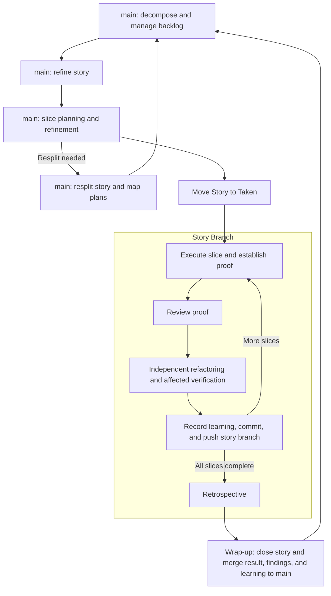

# 0007 — Software development lifecycles

**Status:** Proposed

**Date:** 2026-09-13

**Decision makers:** Terry Yin

**Consulted:** Terry Yin supplied the lifecycle direction; further advice pending.

## Context

Open Dough's skills largely cover the lifecycle with a human facilitator
coordinating decomposition through wrap-up. The next step is a coherent,
uninterrupted agent workflow for one story. Skills retain procedural detail;
this ADR records Open Dough's development lifecycles and their coordination
boundaries. Story Branch Mode is the only lifecycle currently defined.

## Decision

### Story Branch Mode

**Story Branch Mode** keeps story decomposition, product backlog management,
story refinement, and planning on `main`. Before execution, the story moves
to **Taken** on `main`. Execution internally creates the story's feature branch
and Git worktree, invisible to the commanding developer. Implementation and
retrospective run in that story branch.

The coordinator facilitates transitions throughout the lifecycle. The story
branch has no interaction with `main` during execution and retrospective.
Wrap-up bridges the story branch and `main`: it finalizes closure in the branch
and merges the completed product change, retrospective findings, and
product-improvement learning together into `main`. That learning informs
subsequent decomposition and backlog decisions.

Execute related stories sequentially, so each starts from the preceding
story's integrated result and learning. Parallel stories are a deliberate
choice for independent work, not the default.

## Artifacts

- **Product backlog:** shared priorities and queued or taken work.
- **Stories:** goals, scope, and key examples for valuable outcomes.
- **Slice plans:** executable slices, proof, progress, and learning.
- **Architecture North Star:** temporary architectural direction for upcoming work.
- **DearDough.md:** retrospective findings about the development process.

## Consequences

Story isolation reduces coordination interruptions but delays integration
feedback; sequential related work limits that cost. This differs from
[ADR 0002, principle 2](./0002-software-development-lifecycle-principles-accepted.md),
which requires continuous integration into a shared trunk. Acceptance must
explicitly reconcile that difference; this proposal does not supersede it.

Procedures remain in the skills, following
[ADR 0006](./0006-write-skills-for-executing-agents-accepted.md).
