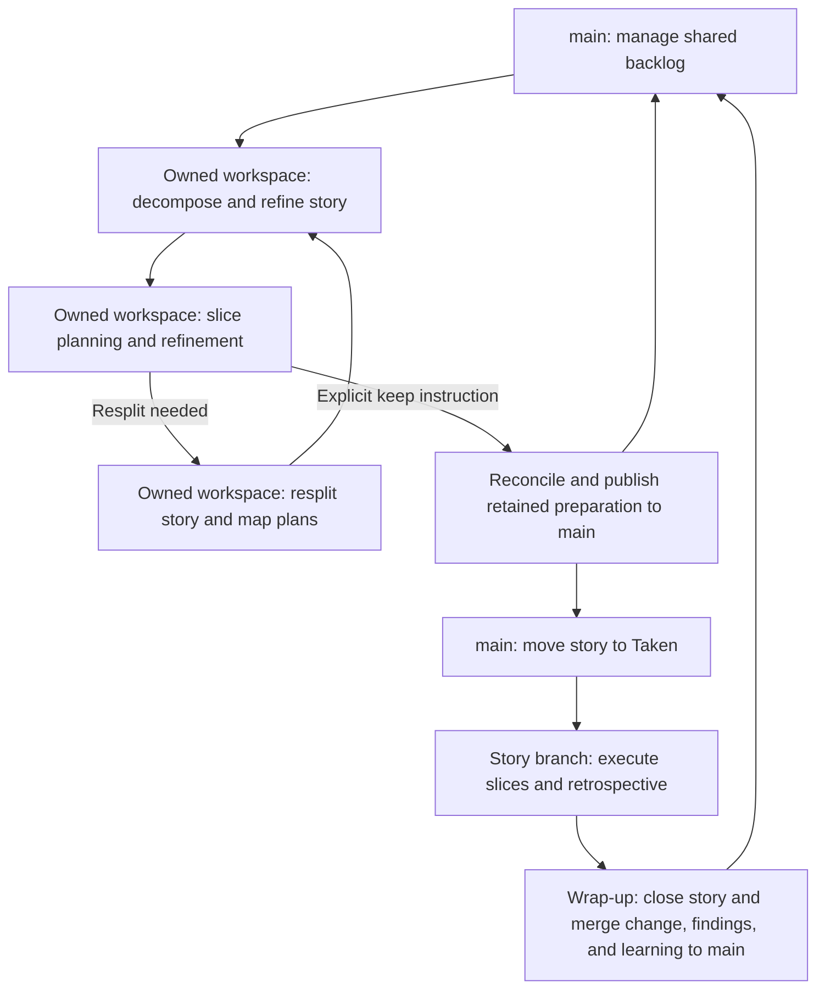

# 0007 — Software development lifecycles

**Status:** Proposed

**Date:** 2026-09-13

**Revised:** 2026-09-26, at Terry Yin's direction.

**Decision makers:** Terry Yin

**Consulted:** Terry Yin supplied the lifecycle direction; further advice pending.

## Context

Agents need clear workspace and integration boundaries from story preparation
through wrap-up. This proposal defines shared assignment rules and Story Branch
Mode boundaries; skills supply the procedures.

## Decision

### Shared work assignments

Before preparing or executing an existing queued story, publish its activity and developer assignment to remote trunk, then attempt safe default
checkout refresh under [ADR 0009](./0009-git-branching-and-integration.md).
Keep unfinished drafts isolated; announcing work does not authorize landing them.

Retain the assignment across pauses. End it automatically when that activity's
completion is confirmed on trunk, or publish its end after explicit abandonment.
Preserve unfinished work unless discard is authorized. Occupied names stay out
of rotation: age or silence cannot establish abandonment. A lingering assignment
is evidence for diagnosis and deliberate recovery. Recovery must not remove a
newer assignment that reused the name. A continuing AI session obtains a fresh
assignment for new work.

### One lifecycle for accepted work

Independently accepted product work enters Taken before execution, including
work that arrives outside the backlog. Reuse an existing owning story or create
one in a suitable seed. Publish the story, Taken entry and assignment together
on remote trunk, then attempt safe default-checkout refresh under
[ADR 0009](./0009-git-branching-and-integration.md).

Queued and emergent work share execution and closure. Keep one authoritative
record for each fact: purpose and preparation in the story, ownership and branch
mode in the assignment, and executable detail in a plan when needed. Planless
work can still be tracked. Closure removes spent tracking and planning records
while preserving enduring product knowledge and unfinished work.

Explicit `--one-shot` execution allows trivial work to publish only its verified
result, without a Taken claim or temporary planning records. If the work grows,
admit it into the ordinary story lifecycle before continuing. This exception
changes tracking overhead; the same workspace, validation and publication rules
apply.

### Story Branch Mode

1. Keep the shared backlog and published preparation records on `main`.
   Write seeds, stories, and plans in an owned workspace, even for tiny
   corrections. Reuse a suitable story, plan, session, or host workspace.
   Reading and discussion require none. Follow the
   [workspace procedure](../../src/skills/dough-story-refinement/references/preparation-workspace.md).
2. Leave drafts in that workspace for review without reserving the shared
   integration checkout. Publish draft results only on an explicit keep
   instruction; honor no-publish and discard instructions through the
   [disposition procedure](../../src/skills/dough-story-refinement/references/preparation-disposition.md).
   A pause or continued discussion is no disposition decision.
3. At execution startup, move the story to **Taken** on `main`, then create its
   feature branch and worktree. Manage these resources for the developer.
   Run implementation and retrospective in that branch without integrating
   with `main` until wrap-up.
4. At wrap-up, finalize closure in the story branch and merge the completed
   change, findings, and learning into `main`. Use that learning for subsequent
   decomposition and backlog decisions.
5. Execute related stories sequentially from the preceding integrated result.
   Run independent stories in parallel only by deliberate choice.

## Artifacts

- **Product backlog:** shared priorities and queued or taken work.
- **Stories:** goals, scope, and key examples for valuable outcomes.
- **Slice plans:** executable slices, proof, progress, and learning.
- **Architecture North Star:** temporary architectural direction for upcoming work.
- **DearDough.md:** retrospective findings about the development process.

## Consequences

Story isolation reduces coordination interruptions but delays integration
feedback; sequential related work limits that cost. This differs from
[ADR 0002, principle 2](./0002-software-development-lifecycle-principles-accepted.md),
which requires continuous integration into a shared trunk. Until a human
resolves that conflict through acceptance with reconciliation or an explicit
exception, follow ADR 0002. This proposal does not supersede it.

Procedures remain in the skills, following
[ADR 0006](./0006-write-skills-for-executing-agents-accepted.md).
