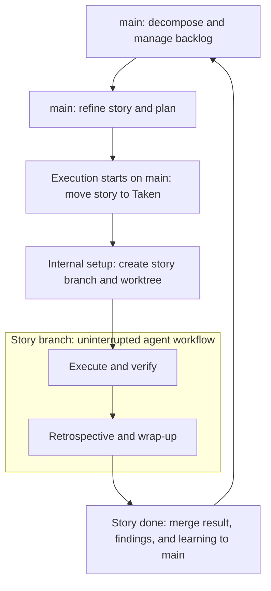

# 0007 — Story Branch development lifecycle

**Status:** Proposed

**Date:** 2026-09-13

**Decision makers:** Terry Yin

**Consulted:** Terry Yin supplied the lifecycle direction; further advice pending.

## Context

Open Dough's skills largely cover the lifecycle with a human facilitator
coordinating decomposition through wrap-up. The next step is a coherent,
uninterrupted agent workflow for one story. Skills retain procedural detail;
this ADR defines the lifecycle and its coordination boundary.

## Decision

**Story Branch Mode** keeps story decomposition, product backlog management,
story refinement, and planning on `main`. When execution starts, it first
moves the story to **Taken** on `main`, then creates the story's feature branch
and Git worktree and implements there. Branch and worktree setup is internal
to execution, invisible to the commanding developer. Execution, retrospective,
and wrap-up run in that story branch.

The story branch has no interaction with `main` during that work. Only when
the story is done does it merge back, carrying the completed product change,
retrospective findings, and product-improvement learning together. That
learning informs subsequent decomposition and backlog decisions.

Execute related stories sequentially, so each starts from the preceding
story's integrated result and learning. Parallel stories are a deliberate
choice for independent work, not the default.

## Consequences

Story isolation reduces coordination interruptions but delays integration
feedback; sequential related work limits that cost. This differs from
[ADR 0002, principle 2](./0002-software-development-lifecycle-principles-accepted.md),
which requires continuous integration into a shared trunk. Acceptance must
explicitly reconcile that difference; this proposal does not supersede it.

Procedures remain in the skills, following
[ADR 0006](./0006-write-skills-for-executing-agents-accepted.md).
