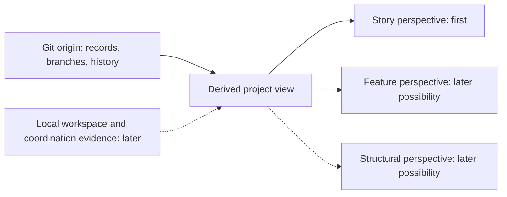

# 0008 — Project dashboard domain and architecture

**Status:** Proposed

**Date:** 2026-09-19

**Decision makers:** Terry Yin

**Consulted:** Terry Yin supplied the direction in the dashboard requirements
discussion; further advice pending.

## Context

Continuous trunk integration makes project progress harder to understand through
story branches alone. Stories can remain unfinished while their increments are
already integrated, and multiple developers can be progressing different work.
Open Dough should provide a graphical view that helps a developer understand
the project's work and progress.

The [project visibility requirements](../project-visibility-requirements.md)
retain the detailed behavior, examples, and exploratory ideas. This proposal
extracts the more stable domain distinctions and architectural intentions. It
does not select an implementation or authorize execution.

The living [Dashboard UX/UI North Star](../dashboard-ux-ui-north-star.md)
provides temporary interface direction and review criteria. Update it through
actual use without treating its design hypotheses as accepted architecture.
The [dashboard technology recommendation](../dashboard-tech-stack.md) separately
proposes a strongly typed stack; its tool choices are not accepted by this ADR.

## Decision

The following is proposed architectural intent, not an accepted decision.

### Domain concepts and relationships

| Concept | Intended meaning |
| --- | --- |
| Project | The product and development work being observed, with its repository as the durable home of workflow records. |
| Story | An intended change or possibility pursued for user or learning value. It may cross existing product and code boundaries, and can exist outside the backlog. |
| Product backlog | The selected, ordered work for the project. Membership is a workflow fact about a story, not the definition of a story. |
| Taken story | Work claimed for execution, with a recorded developer assignment. Taken does not prove that an agent is currently running. |
| Developer assignment | The association of a Taken story with the named developer carrying out its work. An agent can act as a developer; the assignment is distinct from the story's identity. |
| Execution mode | The workflow by which a story is executed and integrated. Story Branch Mode and Trunk Mode have different publication locations. |
| Slice plan and slice | A plan organizes bounded executable slices of a selected story. Recorded slice completion supplies progress evidence; a plan is not mandatory for every story. |
| Feature | Implemented external behavior that users care about, with maintained definition and design, protected by automated tests. It describes capability rather than a promise that a particular user's goal has been satisfied. |
| Structure | The logical organization of the product's implementation, expressed through its domain model and mapped to packages, folders, files, and functions. |
| Local workspace | An owned checkout in which a developer prepares changes and publishes to an authorized remote destination. Several worktrees can share one local repository. |
| Default-checkout ownership | Machine-local access for direct edits and refreshes of the default checkout, with its own recovery and freshness evidence. |

A story changes the product; features and structure remain descriptions of the
product after the story is complete. These are three related dimensions, not
a containment hierarchy. There is no required one-to-one mapping between a
story, a feature, and a structural element. Story-based filtering can expose
relevant features and structure without assigning each exclusively to a story.

Present the story state defined by [ADR 0002](./0002-software-development-lifecycle-principles-accepted.md)
without implying live activity. Distinguish missing, outdated, and conflicting
evidence from an explicit negative result.

### Durable project state and local operational state

The project's repository owns durable workflow records. The dashboard reads
those records to construct its view; it is not an independent authority for
backlog membership, developer assignments, or progress. Any derived cache or
display model must be rebuildable from its sources rather than becoming the
only home of project state.

Initially, one observed project is hardcoded in the dashboard project. There
is no application/server database; optional browser storage is disposable.
This does not introduce project registration or a second authority for state.

The initial source is Git state published to origin, including relevant branch
contents and history. A reader must not need a developer's clone, unpushed
commits, agent conversation, or temporary runtime files to show published
progress. Fetching or caching remote Git data is compatible with this boundary.

For Taken work, the durable record identifies the assigned developer and
execution mode. Story Branch Mode also identifies its execution branch on
origin so the reader can locate published progress. Trunk Mode needs no remote
story-branch field. Local branch and worktree locations belong to the local
operational view rather than required remote backlog metadata.

Machine-local evidence later supplements this view with workspace and
default-checkout activity. Its absence means that local activity is unknown.
Published progress remains visible independently of that local evidence.

These are logical responsibilities and information flows, not prescribed
services, processes, deployment units, or storage technologies.

### Spatial presentation remains derived

The story perspective presents connected work stages with zoom, focus, and
animation, as detailed in the requirements and UX/UI North Star. A visual stage
groups supported workflow facts; drawing a connector does not establish a new
persisted state, a dependency between stories, or a mandatory linear lifecycle.
Story identity and source evidence remain stable independently of card placement.

Viewport position, zoom, focused work, and animation are presentation state,
separate from published project facts and later machine-local coordination
evidence. Losing them loses no project progress. Motion can explain a change
between observed snapshots; it cannot establish unobserved activity. This
intention does not prescribe canvas, a graph library, or stored layout data.
Build these interactions just in time for the selected story's reading goal;
the visual direction does not justify advance navigation infrastructure.

### Observe coordination without owning it

Keep record maintenance and integration coordination in the workflow. Let the
dashboard observe their evidence without requiring a GUI for agent cooperation.

Follow the branching and integration direction in
[ADR 0009](./0009-git-branching-and-integration.md), which remains Proposed.
Owned workspaces publish to remote destinations; remote trunk is the shared
integration authority. The dashboard observes accepted remote revisions for
published progress and uses machine-local evidence for checkout activity.

For participating writers on one machine, coordinate default-checkout access
for direct edits and refreshes. Preparation uses an owned workspace under the
[workspace procedure](../../src/skills/dough-story-refinement/references/preparation-workspace.md).
A deferred local refresh preserves pending work and remains visible separately
from successful remote publication. Independent publication follows the same
Git reconciliation contract across worktrees and machines.

Use the [requirements](../project-visibility-requirements.md) for local-edit,
freshness, and recovery examples. Recheck observable checkout state around
local mutations and preserve changes from human developers and other tools.

### Incremental scope

1. Deliver the story perspective from published Git state alone, treating
   developers as using independent machines. This describes the available
   evidence, not a requirement for physically separate machines.
2. Add coordination and operational visibility for multiple agents sharing a
   local repository through worktrees.

Feature and structural perspectives remain future possibilities, not
prerequisites for either stage. Their domain distinctions should stay clear
without building their machinery in advance.

## Consequences

- The dashboard can be replaced or rebuilt without losing authoritative project
  progress, and the first useful view does not depend on local monitoring.
- Remote visibility is limited to published evidence. Taken work and an old
  update cannot establish that an agent is currently running or has stopped.
- Existing records will need sufficient consistent meaning for observation.
  Exact field formats and workflow changes need their own implementation work;
  this proposal does not make today's records sufficient by declaration.
- Story identity, developer assignment, execution mode, and workspace ownership
  remain distinguishable, avoiding accidental coupling to a temporary branch,
  recycled name, or lock holder.
- Local coordination adds recovery obligations and cannot eliminate semantic
  conflicts or prevent arbitrary writers from bypassing its protocol.

## Open design and related decisions

Record formats, name rotation and reuse, messaging and takeover, recently
finished story views, North Star placement, lock protocols, and detailed stage
layout remain open in the [requirements](../project-visibility-requirements.md#questions-retained-for-later-design).
No GUI framework, daemon, database, schema, or distributed scheduler is selected.

This proposal builds on
[ADR 0001 — Ubiquitous language](./0001-ubiquitous-language-accepted.md),
particularly its story and slice concepts, and
[ADR 0002 — Software development lifecycle principles](./0002-software-development-lifecycle-principles-accepted.md),
particularly whole-product understanding, continuous integration, direct domain
mapping, and incremental learning. No exception to either is proposed.

Treat [ADR 0007](./0007-software-development-lifecycles.md) as a proposal;
follow ADR 0002 while its delayed-integration conflict remains unresolved.
Leave acceptance, supersession, and exceptions to humans under the
[ADR advice process](./README.md).
